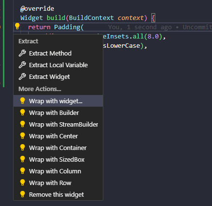

# **Tugas Praktikum Pertemuan 5 - Codelabs: Your first Flutter app**

### **Pemrograman Mobile**

* Nama        : Muhammad Bintang Sholu Firmansyah
* Kelas       : TI-3G
* No Absen    : 16
* NIM         : 2141720101

Github Link https://github.com/bintangsholu21/flutter.git

---

## 3. Membuat project

#### Ganti konten file ini dengan kode berikut:

*pubspec.yaml*

```
name: namer_app
description: A new Flutter project.

publish_to: 'none' # Remove this line if you wish to publish to pub.dev

version: 0.0.1+1

environment:
  sdk: '>=2.19.4 <4.0.0'

dependencies:
  flutter:
    sdk: flutter

  english_words: ^4.0.0
  provider: ^6.0.0

dev_dependencies:
  flutter_test:
    sdk: flutter

  flutter_lints: ^2.0.0

flutter:
  uses-material-design: true
```


---

#### Ganti konten file ini dengan kode berikut:

*analysis_options.yaml*

```
include: package:flutter_lints/flutter.yaml

linter:
  rules:
    prefer_const_constructors: false
    prefer_final_fields: false
    use_key_in_widget_constructors: false
    prefer_const_literals_to_create_immutables: false
    prefer_const_constructors_in_immutables: false
    avoid_print: false
```


---

#### Ganti konten file ini dengan kode berikut:

*lib/main.dart*

```
import 'package:english_words/english_words.dart';
import 'package:flutter/material.dart';
import 'package:provider/provider.dart';

void main() {
  runApp(MyApp());
}

class MyApp extends StatelessWidget {
  const MyApp({super.key});

  @override
  Widget build(BuildContext context) {
    return ChangeNotifierProvider(
      create: (context) => MyAppState(),
      child: MaterialApp(
        title: 'Namer App',
        theme: ThemeData(
          useMaterial3: true,
          colorScheme: ColorScheme.fromSeed(seedColor: Colors.deepOrange),
        ),
        home: MyHomePage(),
      ),
    );
  }
}

class MyAppState extends ChangeNotifier {
  var current = WordPair.random();
}

class MyHomePage extends StatelessWidget {
  @override
  Widget build(BuildContext context) {
    var appState = context.watch<MyAppState>();

    return Scaffold(
      body: Column(
        children: [
          Text('A random idea:'),
          Text(appState.current.asLowerCase),
        ],
      ),
    );
  }
}
```


---
---

## 4. Menambahkan tombol

### **Meluncurkan aplikasi**

Pertama, buka lib/main.dart dan pastikan Anda memilih perangkat target. Di bagian pojok kanan bawah VS Code, Anda akan menemukan tombol yang menampilkan perangkat target saat ini. Klik tombol untuk mengubahnya.


<br>
Selagi lib/main.dart terbuka, temukan tombol "play" di pojok kanan atas jendela VS Code lalu klik tombol tersebut.


<br>
Setelah beberapa saat, aplikasi Anda diluncurkan dalam mode debug. Tampilannya masih terlihat biasa saja:

<br>

### **Hot Reload Pertama**

Di bagian bawah lib/main.dart, tambahkan sesuatu pada string di objek Text pertama, dan simpan file tersebut (dengan Ctrl+S atau Cmd+S). Misalnya:

*lib/main.dart*

```
return Scaffold(
  body: Column(
    children: [
      Text('A random AWESOME idea:'),  // ← Example change.
      Text(appState.current.asLowerCase),
    ],
  ),
);

```

Perhatikan bagaimana aplikasi segera berubah tetapi kata yang acak tetap sama. Situasi ini menunjukkan fitur stateful Hot Reload Flutter terkenal yang sedang bekerja. Hot reload dipicu saat Anda menyimpan perubahan untuk file sumber.


<br>

### **Menambahkan tombol**
Berikutnya, tambahkan tombol di bagian bawah Column, tepat di bawah instance Text kedua.

*lib/main.dart*

```
return Scaffold(
  body: Column(
    children: [
      Text('A random AWESOME idea:'),
      Text(appState.current.asLowerCase),

      // ↓ Add this.
      ElevatedButton(
        onPressed: () {
          print('button pressed!');
        },
        child: Text('Next'),
      ),

    ],
  ),
);
```

Saat Anda menyimpan perubahan, aplikasi diperbarui kembali: Sebuah tombol muncul dan, saat Anda mengklik tombol tersebut, Konsol Debug di VS Code menampilkan pesan button pressed!.


<br>

### **Kursus singkat Flutter 5 menit**

Meskipun menyenangkan melihat Konsol Debug, Anda ingin tombol tersebut melakukan sesuatu yang lebih berguna. Namun, sebelum mencapai ke sana, perhatikan kode pada lib/main.dart lebih dekat, untuk memahami cara kerjanya.

*lib/main.dart*

```
void main() {
  runApp(MyApp());
}
```

Di bagian paling atas file tersebut, Anda akan menemukan fungsi main(). Dalam wujudnya saat ini, fungsi ini hanya memberi tahu Flutter untuk menjalankan aplikasi yang ditentukan pada MyApp.

*lib/main.dart*

```
class MyApp extends StatelessWidget {
  const MyApp({super.key});

  @override
  Widget build(BuildContext context) {
    return ChangeNotifierProvider(
      create: (context) => MyAppState(),
      child: MaterialApp(
        title: 'Namer App',
        theme: ThemeData(
          useMaterial3: true,
          colorScheme: ColorScheme.fromSeed(seedColor: Colors.deepOrange),
        ),
        home: MyHomePage(),
      ),
    );
  }
}
```

Class MyApp memperluas StatelessWidget. Widget adalah elemen tempat Anda membangun setiap aplikasi Flutter. Seperti yang dapat Anda lihat, bahkan aplikasi itu sendiri adalah widget.

#### **Catatan**: Kita akan mencapai penjelasan StatelessWidget (dibandingkan StatefulWidget) kemudian.

Kode pada MyApp menyusun keseluruhan aplikasi. Kode ini membuat status seluruh aplikasi (Anda akan mempelajari hal ini lebih lanjut nanti), memberi nama aplikasi, menentukan tema visual, dan mengatur widget "home"—titik awal aplikasi Anda.

*lib/main.dart*

```
class MyAppState extends ChangeNotifier {
  var current = WordPair.random();
}

```

Berikutnya, class MyAppState menentukan...yah...status aplikasi. Percobaan ini adalah percobaan pertama Anda menggunakan Flutter, jadi codelab ini akan menjaga status aplikasi tetap sederhana dan terpusat. Ada banyak cara ampuh untuk mengelola status aplikasi di Flutter. Salah satu yang paling mudah untuk dijelaskan adalah ChangeNotifier, pendekatan yang diambil oleh aplikasi ini.

* MyAppState menjelaskan data yang diperlukan oleh aplikasi ini agar berjalan dengan baik. Saat ini, kode ini hanya berisi variabel tunggal dengan pasangan kata acak saat ini. Anda akan menambahkannya nanti.
* Class status memperluas ChangeNotifier, yang artinya kode ini dapat memberi tahu kode lain tentang perubahannya sendiri. Misalnya, jika pasangan kata saat ini berubah, beberapa widget dalam aplikasi perlu mengetahuinya.
* Status dibuat dan disediakan untuk seluruh aplikasi menggunakan ChangeNotifierProvider (lihat kode di atas pada MyApp). Hal ini memungkinkan widget mana pun pada aplikasi untuk mendapatkan status.


<br>

*lib/main.dart*

```
class MyHomePage extends StatelessWidget {
  @override
  Widget build(BuildContext context) {           // ← 1
    var appState = context.watch<MyAppState>();  // ← 2

    return Scaffold(                             // ← 3
      body: Column(                              // ← 4
        children: [
          Text('A random AWESOME idea:'),        // ← 5
          Text(appState.current.asLowerCase),    // ← 6
          ElevatedButton(
            onPressed: () {
              print('button pressed!');
            },
            child: Text('Next'),
          ),
        ],                                       // ← 7
      ),
    );
  }
}

```

Terakhir, ada MyHomePage, widget yang telah Anda modifikasi. Setiap baris bernomor di bawah memetakan ke komentar nomor baris pada kode di atas:

1. Setiap widget menentukan metode build() yang dipanggil secara otomatis setiap kali kondisi widget berubah agar widget selalu dalam kondisi terbaru.
2. MyHomePage melacak perubahan terhadap status aplikasi saat ini menggunakan metode watch.
3. Setiap metode build harus menampilkan widget atau (yang lebih umum) pohon widget bertingkat. Dalam hal ini, widget tingkat tertinggi adalah Scaffold. Anda tidak akan bekerja dengan Scaffold dalam codelab ini, tetapi ini adalah widget yang berguna dan dapat ditemukan di sebagian besar aplikasi Flutter di dunia nyata.
4. Column adalah salah satu widget tata letak paling dasar pada Flutter. Widget tata letak ini mengambil sejumlah turunan dan menempatkannya pada kolom dari atas ke bawah. Secara default, kolom menempatkan turunan-turunannya secara visual di bagian atas. Anda akan segera mengubah ini agar kolom terpusat di tengah.
5. Anda mengubah widget Text ini pada langkah pertama.
6. Widget Text kedua ini mengambil appState, dan mengakses satu-satunya anggota dari class tersebut, current (yang merupakan WordPair). WordPair menyediakan beberapa pengambil yang berguna, seperti asPascalCase atau asSnakeCase. Di sini, kita menggunakan asLowerCase, tetapi Anda dapat mengubah ini sekarang jika Anda lebih menyukai salah satu alternatif yang ada.
7. Perhatikan bagaimana kode Flutter banyak menggunakan koma di akhir. Koma ini tidak harus ada, karena children adalah anggota terakhir (dan juga satu-satunya) dari daftar parameter Column ini. Namun, menggunakan koma di akhir umumnya adalah ide yang bagus: koma di akhir membuat penambahan anggota menjadi mudah, dan koma di akhir juga berfungsi sebagai petunjuk bagi pemformat otomatis Dart untuk meletakkan baris baru. Untuk informasi lebih lanjut, lihat panduan Pemformatan kode.


Berikutnya, Anda akan menghubungkan tombol dengan status.

<br>

### **Perilaku pertama Anda**

Scroll ke MyAppState lalu tambahkan metode getNext.

*lib/main.dart*

```

class MyAppState extends ChangeNotifier {
  var current = WordPair.random();

  // ↓ Add this.
  void getNext() {
    current = WordPair.random();
    notifyListeners();
  }
}

```

Metode getNext() baru menetapkan ulang current dengan WordPair acak baru. Metode ini juga memanggil notifyListeners()(metode ChangeNotifier) yang memastikan bahwa semua orang yang melihat MyAppState diberi tahu.


Tindakan terakhir adalah memanggil metode getNext dari callback tombol tersebut.

*lib/main.dart*

```

    ElevatedButton(
      onPressed: () {
        appState.getNext();  // ← This instead of print().
      },
      child: Text('Next'),
    ),

```

Simpan dan uji coba aplikasi sekarang. Aplikasi akan menghasilkan pasangan kata acak baru setiap kali Anda menekan tombol Next.


* Sebelum tombo Next ditekan<br>

<br>
* Setelah tombol Next ditekan<br>


Pada bagian berikutnya, Anda akan memperindah tampilan antarmuka pengguna.

---
---

## 5. Memperindah tampilan aplikasi

### **Mengekstrak widget**

Baris yang bertanggung jawab untuk menampilkan pasangan kata saat ini kini tampak seperti berikut: `` Text(appState.current.asLowerCase)``. Untuk mengubahnya menjadi sesuatu yang lebih kompleks, disarankan untuk mengekstrak baris ini ke widget terpisah. Memiliki beberapa widget untuk beberapa bagian logis dari UI Anda adalah cara penting dalam mengelola kompleksitas pada Flutter.

Flutter menyediakan pembantu pemfaktoran ulang untuk mengekstrak widget, tetapi sebelum Anda menggunakannya, pastikan bahwa baris yang akan diekstrak hanya mengakses yang diperlukan. Sekarang baris tersebut mengakses ``appState``, tetapi sebenarnya baris tersebut hanya perlu mengetahui apa pasangan kata saat ini.

Oleh karena itu, tulis ulang widget ``MyHomePage`` sebagai berikut:

*lib/main.dart*

```
class MyHomePage extends StatelessWidget {
  @override
  Widget build(BuildContext context) {
    var appState = context.watch<MyAppState>();
    var pair = appState.current;                 // ← Add this.

    return Scaffold(
      body: Column(
        children: [
          Text('A random AWESOME idea:'),
          Text(pair.asLowerCase),                // ← Change to this.
          ElevatedButton(
            onPressed: () {
              appState.getNext();
            },
            child: Text('Next'),
          ),
        ],
      ),
    );
  }
}
```

Bagus. Widget `Text` tidak lagi merujuk kepada keseluruhan appState.

Sekarang, panggil menu **Refactor**. Pada VS Code, Anda melakukan ini melalui salah satu dari dua cara:

1. Klik kanan potongan kode yang ingin Anda faktorkan ulang (dalam hal ini `Text`) dan pilih Refactor... dari menu drop-down,

ATAU

2. Pindahkan kursor Anda ke potongan kode yang ingin Anda faktorkan ulang (dalam hal ini, `Text`), lalu tekan `Ctrl+`. (Win/Linux) atau Cmd+. (Mac).


Pada menu *Refactor*, pilih *Extract Widget*. Tetapkan nama, seperti `BigCard`, lalu klik Enter.

Tindakan ini secara otomatis membuat class baru, `BigCard`, di akhir file saat ini. Class tersebut akan terlihat seperti berikut:

*lib/main.dart*


```
class BigCard extends StatelessWidget {
  const BigCard({
    super.key,
    required this.pair,
  });

  final WordPair pair;

  @override
  Widget build(BuildContext context) {
    return Text(pair.asLowerCase);
  }
}
```
<br>

Perhatikan bagaimana aplikasi tetap berjalan meskipun pemfaktoran ulang sedang berlangsung.

### **Menambahkan Kartu**

Sekarang saatnya membuat widget baru ini menjadi UI tebal yang kita bayangkan di awal bagian ini.

Temukan class `BigCard` dan metode `build()` yang berada di dalamnya. Sama seperti sebelumnya, panggil menu **Refactor** pada widget `Text`. Namun, kali ini Anda tidak akan mengekstrak widget.

Sebagai gantinya, pilih **Wrap with Padding**. Tindakan ini menciptakan widget induk baru di sekitar widget Text bernama `Padding`. Setelah menyimpannya, Anda akan melihat bahwa kata acak tersebut telah memiliki ruang yang lebih luas.

<br>
<br>

Tingkatkan padding dari nilai default `8.0`. Misalnya, gunakan `20` untuk padding yang lebih luas.


#### **Catatan:** Flutter menggunakan Komposisi, bukan Pewarisan, kapan pun tersedia. Di sini, padding tidak menjadi atribut dari Text, melainkan sebuah widget!

#### Dengan begitu, widget dapat fokus pada tanggung jawab masing-masing, dan Anda, sebagai developer, memiliki kebebasan penuh mengenai cara menyusun UI. Misalnya, Anda dapat menggunakan widget Padding untuk memberikan padding pada teks, gambar, tombol, widget kustom Anda sendiri, atau keseluruhan aplikasi. Widget tidak peduli dengan apa yang dikemas.


Berikutnya, mari kita naik satu tingkat lebih tinggi. Tempatkan kursor Anda pada widget `Padding`, buka menu **Refactor**, lalu pilih **Wrap with widget**....

Tindakan ini memungkinkan Anda untuk menentukan widget induk. Ketik "Card" dan tekan **Enter**.

<br>
<br>

Kode ini menggabungkan widget `Padding`, dan juga `Text`, dengan widget `Card`.

<br>

### **Tema dan gaya**

Untuk membuat kartu menjadi lebih menarik, beri warna yang lebih kaya pada kartu tersebut. Karena ada baiknya untuk menjaga skema warna yang konsisten, gunakan `Theme` aplikasi untuk memilih warna.

Buat perubahan berikut untuk metode `build() BigCard`.

*lib/main.dart*

```
  @override
  Widget build(BuildContext context) {
    final theme = Theme.of(context);       // ← Add this.

    return Card(
      color: theme.colorScheme.primary,    // ← And also this.
      child: Padding(
        padding: const EdgeInsets.all(20),
        child: Text(pair.asLowerCase),
      ),
    );
  }
```

Kedua baris baru ini melakukan banyak hal:

* Pertama, kode ini meminta tema aplikasi saat ini dengan Theme.of(context).
* Kemudian, kode ini menentukan warna kartu agar sama dengan properti colorScheme dari tema. Skema warna menampung banyak warna, dan primary adalah warna aplikasi yang paling terlihat dan mencolok.

Kini, kartu telah diwarnai dengan warna primer aplikasi:


Anda dapat mengubah warna ini serta skema warna keseluruhan aplikasi dengan men-scroll ke atas ke MyApp dan mengubah warna seed untuk ColorScheme di sana.

**Tips :** Class `Colors` Flutter memberikan akses mudah ke palet warna pilihan kepada Anda, seperti `Colors.deepOrange` atau `Colors.red`. Namun, pastinya Anda dapat memilih warna apa saja. Misalnya, untuk menentukan warna hijau murni dengan opasitas penuh, gunakan `Color.fromRGBO(0, 255, 0, 1.0)`. Jika Anda adalah penggemar angka heksadesimal, selalu ada `Color(0xFF00FF00)`.


Perhatikan bagaimana warna berubah dengan halus. Perubahan ini disebut `animasi implisit`. Banyak widget Flutter akan berinterpolasi antarnilai dengan lancar agar UI tidak hanya "berpindah" antarstatus.

Tombol timbul di bawah kartu juga berubah warna. Itulah kelebihan dalam menggunakan ``Theme`` seluruh aplikasi dibandingkan dengan nilai hard-code.


### **TextTheme**

Kartu tersebut masih memiliki masalah: ukuran teks terlalu kecil dan warnanya membuat teks sulit dibaca. Untuk memperbaiki masalah ini, buat perubahan berikut pada metode build() BigCard.

*lib/main.dart*

```
  @override
  Widget build(BuildContext context) {
    final theme = Theme.of(context);
    // ↓ Add this.
    final style = theme.textTheme.displayMedium!.copyWith(
      color: theme.colorScheme.onPrimary,
    );

    return Card(
      color: theme.colorScheme.primary,
      child: Padding(
        padding: const EdgeInsets.all(20),
        // ↓ Change this line.
        child: Text(pair.asLowerCase, style: style),
      ),
    );
  }
```

### **Meningkatkan aksesibilitas**

*lib/main.dart*

```
  @override
  Widget build(BuildContext context) {
    final theme = Theme.of(context);
    final style = theme.textTheme.displayMedium!.copyWith(
      color: theme.colorScheme.onPrimary,
    );

    return Card(
      color: theme.colorScheme.primary,
      child: Padding(
        padding: const EdgeInsets.all(20),

        // ↓ Make the following change.
        child: Text(
          pair.asLowerCase,
          style: style,
          semanticsLabel: "${pair.first} ${pair.second}",
        ),
      ),
    );
  }
  ```

### **Menempatkan UI di tengah**

Pertama, ingatlah bahwa BigCard adalah bagian dari Column. Secara default, kolom menggabungkan turunan kolom di bagian atas, tetapi kita dapat mengganti ini dengan mudah. Buka metode build() MyHomePage, dan buat perubahan berikut:

*lib/main.dart*


```
class MyHomePage extends StatelessWidget {
  @override
  Widget build(BuildContext context) {
    var appState = context.watch<MyAppState>();
    var pair = appState.current;

    return Scaffold(
      body: Column(
        mainAxisAlignment: MainAxisAlignment.center,  // ← Add this.
        children: [
          Text('A random AWESOME idea:'),
          BigCard(pair: pair),
          ElevatedButton(
            onPressed: () {
              appState.getNext();
            },
            child: Text('Next'),
          ),
        ],
      ),
    );
  }
}
```


Dengan perubahan opsional, MyHomePage mencakup kode berikut:

*lib/main.dart*

```
class MyHomePage extends StatelessWidget {
  @override
  Widget build(BuildContext context) {
    var appState = context.watch<MyAppState>();
    var pair = appState.current;

    return Scaffold(
      body: Center(
        child: Column(
          mainAxisAlignment: MainAxisAlignment.center,
          children: [
            BigCard(pair: pair),
            SizedBox(height: 10),
            ElevatedButton(
              onPressed: () {
                appState.getNext();
              },
              child: Text('Next'),
            ),
          ],
        ),
      ),
    );
  }
}
```

Aplikasinya akan terlihat seperti berikut:

