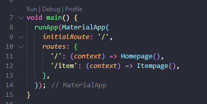

# **UTS**

### **Pemrograman Mobile**

* Nama        : Muhammad Bintang Sholu Firmansyah
* Kelas       : TI-3G
* No Absen    : 16
* NIM         : 2141720101

Github Link https://github.com/bintangsholu21/pemrograman-mobile

---
---

### Konsep Navigasi dan Rute

Perpindahan halaman di Flutter, ditangani oleh Navigator dengan melibatkan konsep sebagai berikut:

* Navigator: sebuah widget yang mengatur tumpukan (struktur data stack) dari objek rute.
* Route: sebuah objek yang merepresentasikan tampilan, umumnya diimplementasikan oleh class seperti MaterialPageRoute.

Sebuah Route umumnya dimasukkan (push) atau diambil (pop) dari dan ke tumpukan Navigator. Ketika sebuah halaman dilakukan operasi push, maka halaman tersebut akan diletakkan di atas halaman yang memanggilnya. Ilustrasi tersebut dapat anda lihat pada gambar berikut. Dan jika pop dipanggil (tombol back ditekan) maka aplikasi akan menampilkan halaman sebelumnya. Selain itu Flutter juga mendukung adanya penamaan Route yang didefinisikan di awal.

  

---
### Praktikum 5: Membangun Navigasi di Flutter

>**Apa yang akan Anda pelajari**
>
>Cara kerja mekanisme navigation dan route di Flutter.
Cara membuat navigation dan route di Flutter.
Selesaikan langkah-langkah praktikum berikut ini menggunakan editor Visual Studio Code (VS Code) atau Android Studio atau code editor lain kesukaan Anda. Materi ini dapat dimasukkan ke Laporan Praktikum folder Week atau Pertemuan 08.

#### **Langkah 1: Siapkan project baru**

Sebelum melanjutkan praktikum, buatlah sebuah project baru Flutter dengan nama belanja dan susunan folder seperti pada gambar berikut. Penyusunan ini dimaksudkan untuk mengorganisasi kode dan widget yang lebih mudah.

  

#### **Langkah 2: Mendefinisikan Route**

Buatlah dua buah file dart dengan nama home_page.dart dan item_page.dart pada folder pages. Untuk masing-masing file, deklarasikan class HomePage pada file home_page.dart dan ItemPage pada item_page.dart. Turunkan class dari StatelessWidget. Gambaran potongan kode dapat anda lihat sebagai berikut.
  
  

#### **Langkah 3: Lengkapi Kode di main.dart**

Setelah kedua halaman telah dibuat dan didefinisikan, bukalah file main.dart. Pada langkah ini anda akan mendefinisikan Route untuk kedua halaman tersebut. Definisi penamaan route harus bersifat unique. Halaman HomePage didefinisikan sebagai /. Dan halaman ItemPage didefinisikan sebagai /item. Untuk mendefinisikan halaman awal, anda dapat menggunakan named argument initialRoute. Gambaran tahapan ini, dapat anda lihat pada potongan kode berikut.

  

#### **Langkah 4: Membuat data model**

Sebelum melakukan perpindahan halaman dari HomePage ke ItemPage, dibutuhkan proses pemodelan data. Pada desain mockup, dibutuhkan dua informasi yaitu nama dan harga. Untuk menangani hal ini, buatlah sebuah file dengan nama item.dart dan letakkan pada folder models. Pada file ini didefinisikan pemodelan data yang dibutuhkan. Ilustrasi kode yang dibutuhkan, dapat anda lihat pada potongan kode berikut.
  

#### **Langkah 5: Lengkapi kode di class HomePage**

Pada halaman HomePage terdapat ListView widget. Sumber data ListView diambil dari model List dari object Item. Gambaran kode yang dibutuhkan untuk melakukan definisi model dapat anda lihat sebagai berikut.

  

#### **Langkah 6: Membuat ListView dan itemBuilder**

Untuk menampilkan ListView pada praktikum ini digunakan itemBuilder. Data diambil dari definisi model yang telah dibuat sebelumnya. Untuk menunjukkan batas data satu dan berikutnya digunakan widget Card. Kode yang telah umum pada bagian ini tidak ditampilkan. Gambaran kode yang dibutuhkan dapat anda lihat sebagai berikut.

  

Jalankan aplikasi pada emulator atau pada device anda.

>Perhatian: Pastikan pada halaman awal telah berhasil menampilkan ListView. Jika ada kesalahan, segera perbaiki sebelum melanjutkan ke langkah berikutnya.

#### **Langkah 7: Menambahkan aksi pada ListView**

Item pada ListView saat ini ketika ditekan masih belum memberikan aksi tertentu. Untuk menambahkan aksi pada ListView dapat digunakan widget InkWell atau GestureDetector. Perbedaan utamanya InkWell merupakan material widget yang memberikan efek ketika ditekan. Sedangkan GestureDetector bersifat umum dan bisa juga digunakan untuk gesture lain selain sentuhan. Pada praktikum ini akan digunakan widget InkWell.

Untuk menambahkan sentuhan, letakkan cursor pada widget pembuka Card. Kemudian gunakan shortcut quick fix dari VSCode (Ctrl + . pada Windows atau Cmd + . pada MacOS). Sorot menu wrap with widget... Ubah nilai widget menjadi InkWell serta tambahkan named argument onTap yang berisi fungsi untuk berpindah ke halaman ItemPage. Ilustrasi potongan kode dapat anda lihat pada potongan berikut.

  

Jalankan aplikasi kembali dan pastikan ListView dapat disentuh dan berpindah ke halaman berikutnya. Periksa kembali jika terdapat kesalahan.

Output Akhir :

  