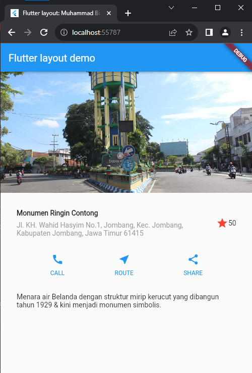

# **UTS**

### **Pemrograman Mobile**

* Nama        : Muhammad Bintang Sholu Firmansyah
* Kelas       : TI-3G
* No Absen    : 16
* NIM         : 2141720101

Github Link https://github.com/bintangsholu21/pemrograman-mobile

---
---

### Praktikum 4: Implementasi image section
Selesaikan langkah-langkah praktikum berikut ini dengan melanjutkan dari praktikum sebelumnya.
#### **Langkah 1: Siapkan aset gambar**
Anda dapat mencari gambar di internet yang ingin ditampilkan. Buatlah folder images di root project layout_flutter. Masukkan file gambar tersebut ke folder images, lalu set nama file tersebut ke file pubspec.yaml seperti berikut:

Contoh nama file gambar di atas adalah foto-bola.jpeg

```
TIPS

Perhatikan bahwa pubspec.yaml sensitif terhadap huruf besar-kecil, jadi tulis assets: dan URL gambar seperti yang ditunjukkan di atas.
File pubspec juga sensitif terhadap spasi, jadi gunakan indentasi yang tepat.
Anda mungkin perlu memulai ulang program yang sedang berjalan (baik di simulator atau perangkat yang terhubung) agar perubahan pubspec dapat diterapkan.
```


#### **Langkah 2: Tambahkan gambar ke body**
Tambahkan aset gambar ke dalam body seperti berikut:
<br><br>

BoxFit.cover memberi tahu kerangka kerja bahwa gambar harus sekecil mungkin tetapi menutupi seluruh kotak rendernya.

#### **Langkah 3: Terakhir, ubah menjadi ListView**
Pada langkah terakhir ini, atur semua elemen dalam ListView, bukan Column, karena ListView mendukung scroll yang dinamis saat aplikasi dijalankan pada perangkat yang resolusinya lebih kecil.

Output :

<br><br>

---

### Tugas Praktikum 1

1. Selesaikan Praktikum 1 sampai 4, lalu dokumentasikan dan push ke repository Anda berupa screenshot setiap hasil pekerjaan beserta penjelasannya di file README.md!

2. Silakan implementasikan di project baru "basic_layout_flutter" dengan mengakses sumber ini: https://docs.flutter.dev/codelabs/layout-basics

3. Kumpulkan link commit repository GitHub Anda ke spreadsheet yang telah disediakan!