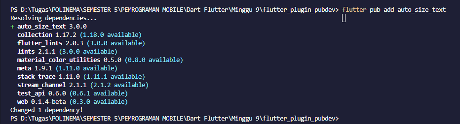
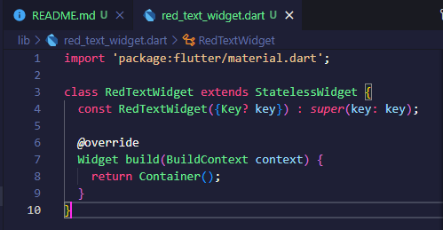
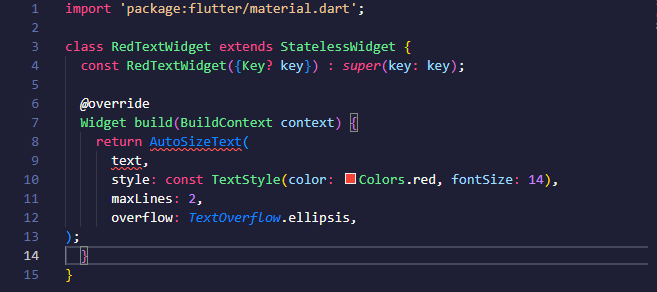
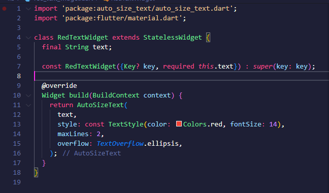
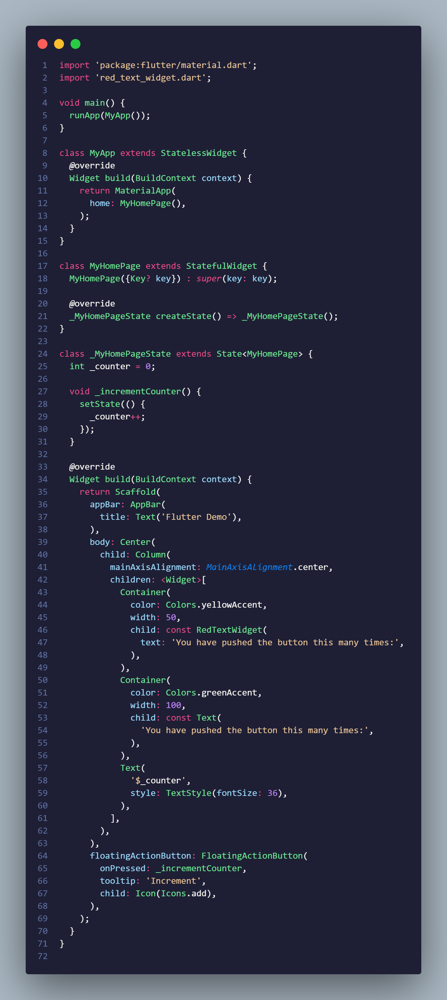
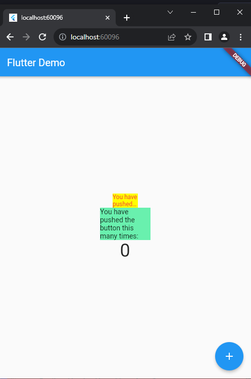
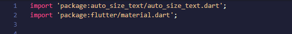
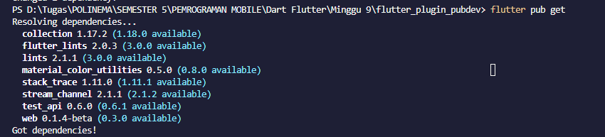

# **Manajemen Plugin**

### **Pemrograman Mobile**

* Nama        : Muhammad Bintang Sholu Firmansyah
* Kelas       : TI-3G
* No Absen    : 16
* NIM         : 2141720101

Github Link https://github.com/bintangsholu21/pemrograman-mobile

---
---

### **7. Praktikum Menerapkan Plugin di Project Flutter**

Selesaikan langkah-langkah praktikum berikut ini menggunakan editor Visual Studio Code (VS Code) atau Android Studio atau code editor lain kesukaan Anda.

>Perhatian: Diasumsikan Anda telah berhasil melakukan setup environment Flutter SDK, VS Code, Flutter Plugin, dan Android SDK pada pertemuan pertama.

#### **Langkah 1: Buat Project Baru**

Buatlah sebuah project flutter baru dengan nama **flutter_plugin_pubdev**. Lalu jadikan repository di GitHub Anda dengan nama **flutter_plugin_pubdev**.

#### **Langkah 2: Menambahkan Plugin**
Tambahkan plugin `auto_size_text` menggunakan perintah berikut di terminal

```
flutter pub add auto_size_text
```
Jika berhasil, maka akan tampil nama plugin beserta versinya di file `pubspec.yaml` pada bagian dependencies.




#### **Langkah 3: Buat file red_text_widget.dart**

Buat file baru bernama red_text_widget.dart di dalam folder lib lalu isi kode seperti berikut.
```
import 'package:flutter/material.dart';

class RedTextWidget extends StatelessWidget {
  const RedTextWidget({Key? key}) : super(key: key);

  @override
  Widget build(BuildContext context) {
    return Container();
  }
}
```



#### **Langkah 4: Tambah Widget AutoSizeText**

Masih di file red_text_widget.dart, untuk menggunakan plugin auto_size_text, ubahlah kode return Container() menjadi seperti berikut.
```
return AutoSizeText(
      text,
      style: const TextStyle(color: Colors.red, fontSize: 14),
      maxLines: 2,
      overflow: TextOverflow.ellipsis,
);
```
Setelah Anda menambahkan kode di atas, Anda akan mendapatkan info error. Mengapa demikian? Jelaskan dalam laporan praktikum Anda!

<br>


#### **Langkah 5: Buat Variabel text dan parameter di constructor**
Tambahkan variabel text dan parameter di constructor seperti berikut.
```
final String text;

const RedTextWidget({Key? key, required this.text}) : super(key: key);
```
<br><br>

#### **Langkah 6: Tambahkan widget di main.dart**

Buka file main.dart lalu tambahkan di dalam children: pada class _MyHomePageState
```
Container(
   color: Colors.yellowAccent,
   width: 50,
   child: const RedTextWidget(
             text: 'You have pushed the button this many times:',
          ),
),
Container(
    color: Colors.greenAccent,
    width: 100,
    child: const Text(
           'You have pushed the button this many times:',
          ),
),
```


<br><br>
Run aplikasi tersebut dengan tekan F5, maka hasilnya akan seperti berikut.

<br><br>


---

### **Tugas Praktikum**

1. Selesaikan Praktikum tersebut, lalu dokumentasikan dan push ke repository Anda berupa screenshot hasil pekerjaan beserta penjelasannya di file README.md!
<br>

2. Jelaskan maksud dari langkah 2 pada praktikum tersebut!

    **Penjelasan** 

    Perintah `flutter pub add auto_size_text` digunakan untuk secara otomatis menambahkan paket Flutter bernama "auto_size_text" ke proyek Anda. Ini memperbarui berkas proyek Anda, mengunduh dan menginstal paket tersebut, dan memungkinkan Anda untuk menggunakan fungsionalitas dari paket "auto_size_text" dalam proyek Flutter Anda tanpa harus mengelola dependensi secara manual.

<br>

3. Jelaskan maksud dari langkah 5 pada praktikum tersebut!


    **Penjelasan** 

    Terjadi error pada Langkah 4 karena perubahan yang Anda lakukan pada red_text_widget.dart memerlukan beberapa perubahan tambahan dalam proyek Anda. Berikut adalah beberapa penyebab umum error:

    1. **Impor Paket yang Tidak Dilakukan**: Anda harus mengimpor paket auto_size_text ke dalam berkas red_text_widget.dart agar Anda dapat menggunakan komponen-komponen dari paket tersebut. Jika Anda tidak mengimpor paket ini, maka Flutter tidak akan mengenali simbol AutoSizeText.

    2. **Variabel text yang Tidak Didefinisikan**: Variabel text yang Anda gunakan dalam AutoSizeText perlu didefinisikan terlebih dahulu di dalam metode build. Variabel ini harus mengandung teks yang akan ditampilkan oleh AutoSizeText.

    3. **Paket Belum Diunduh**: Perintah flutter pub get belum dijalankan setelah menambahkan dependensi paket. Ini menyebabkan Flutter tidak dapat menemukan paket "auto_size_text" karena paket tersebut belum diunduh dan diinstal dalam proyek Anda.

    **SOLUSI**

    * Import `package:auto_size_text/auto_size_text.dart`
    <br><br>

    * Import `flutter pub get`
    <br><br>
<br>

4. Pada langkah 6 terdapat dua widget yang ditambahkan, jelaskan fungsi dan perbedaannya!


    1. **RedTextWidget**:
        - **Fungsi**: Widget `RedTextWidget` adalah widget yang telah Anda buat sendiri dalam langkah sebelumnya. Tujuannya adalah untuk menampilkan teks dengan warna merah dan menggunakan fitur auto-sizing (mengubah ukuran teks sesuai dengan ruang yang tersedia).
        - **Perbedaan**: Widget ini khusus dibuat untuk menampilkan teks dengan gaya dan perilaku tertentu, yaitu dengan warna merah, pembatasan maksimal dua baris, dan menggunakan auto-sizing untuk memastikan teks sesuai dengan ruang yang tersedia.

    2. **Text Widget**:
        - **Fungsi**: Widget `Text` adalah widget bawaan Flutter yang digunakan untuk menampilkan teks statis. Dalam kasus ini, Anda menggunakan widget `Text` untuk menampilkan teks yang sama dengan yang ditampilkan oleh `RedTextWidget`, tetapi tanpa gaya khusus atau perilaku auto-sizing.
        - **Perbedaan**: Widget `Text` adalah widget dasar yang digunakan untuk menampilkan teks tanpa pengaturan gaya atau perilaku khusus. Anda dapat menambahkan teks apa pun ke dalamnya, tetapi tidak ada perubahan ukuran atau gaya tertentu yang diatur secara otomatis.
<br>

5. Jelaskan maksud dari tiap parameter yang ada di dalam plugin auto_size_text berdasarkan tautan pada dokumentasi ini !

    1. **text** (`String`):
        - Parameter ini adalah teks yang akan ditampilkan oleh `AutoSizeText`. Ini adalah teks yang akan disesuaikan ukurannya sesuai dengan ruang yang tersedia.

    2. **style** (`TextStyle`):
        - Parameter ini digunakan untuk mengatur gaya teks seperti warna, ukuran font, tebal, dan sebagainya. Dalam contoh yang Anda berikan, warna teks diatur menjadi merah dengan ukuran font 14.

    3. **maxLines** (`int`):
        - Parameter ini digunakan untuk membatasi jumlah baris maksimal yang akan ditampilkan oleh `AutoSizeText`. Jika teks melebihi jumlah baris yang ditentukan, teks akan dipotong dengan "..." (elipsis).

    4. **overflow** (`TextOverflow`):
        - Parameter ini digunakan untuk menentukan bagaimana teks yang melebihi jumlah baris maksimal (`maxLines`) akan ditampilkan. `TextOverflow.ellipsis` digunakan dalam contoh Anda, yang berarti teks yang melewati batas akan ditampilkan dengan elipsis ("...").
<br>

6. Kumpulkan laporan praktikum Anda berupa link repository GitHub ke spreadsheet yang telah disediakan!


